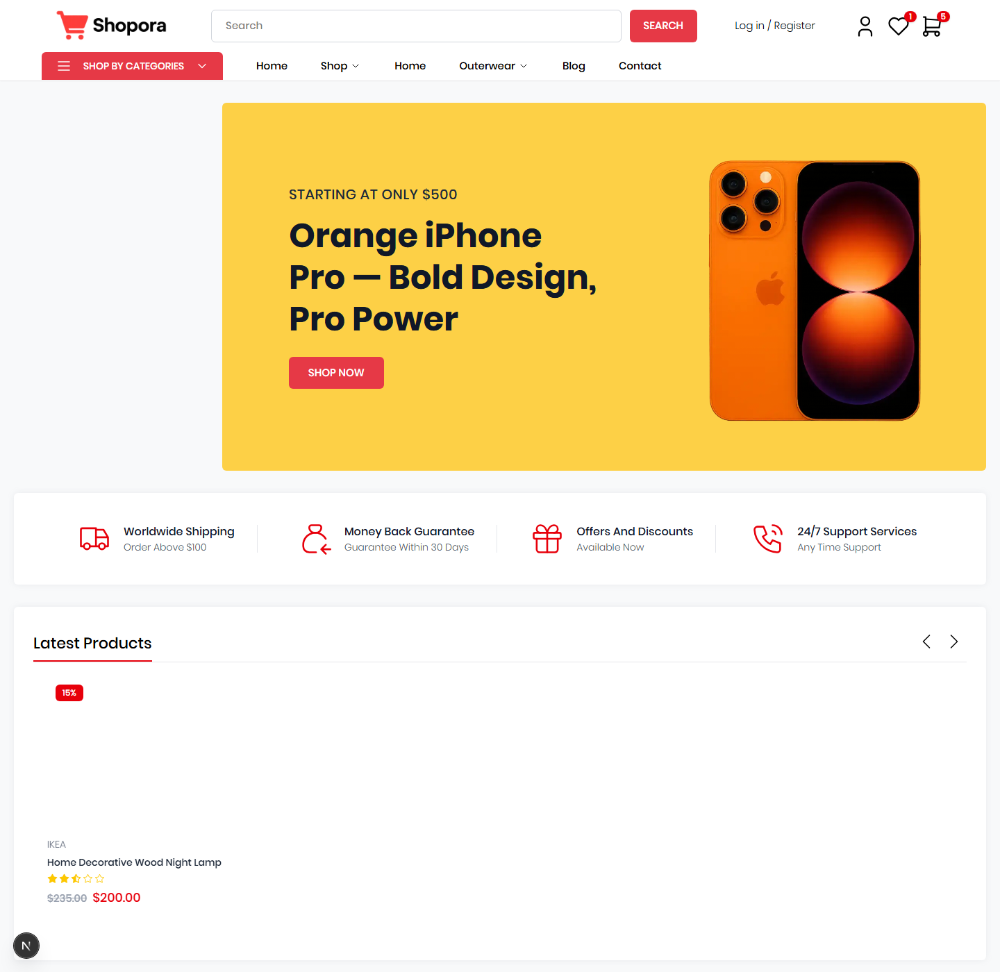

# Shapora

> A modern frontend e-commerce showcase built with Next.js, Redux Toolkit, Tailwind CSS 4, Framer Motion, and Swiper.

[Live Preview](https://shapora.mobincodes.com) | [Persian README](./README.fa.md)



## Overview

Shapora is a polished storefront showcase built with the Next.js App Router. The project leans into a dense, commerce-first layout with a large hero area, product sliders, category browsing, promo blocks, deal timers, brand showcases, testimonials, newsletter capture, cart flows, and account pages.

The repository also includes a few backend-shaped files, but the core experience is a frontend-first storefront designed for presentation, iteration, and reuse.

## Highlights

- Next.js App Router architecture with route groups
- Full storefront navigation with search, account, wishlist, and cart entry points
- Hero slider and multiple product slider variants
- Product filtering, pagination, and detail pages
- Featured, latest, best-selling, category, deal, and brand sections
- Redux Toolkit state management
- Localized and reusable UI primitives for badges, buttons, ratings, timers, and accordions
- Production build verified with `next build`

## Tech Stack

| Area | Tools |
| --- | --- |
| Frontend | Next.js 16, React 19, Tailwind CSS 4 |
| State | Redux Toolkit, React Redux |
| Motion | Framer Motion |
| Sliders | Swiper |
| Time / Data | date-fns |
| UI | SVG icons, custom badges, reusable cards and sliders |

## Project Structure

```txt
app/              # App Router pages and API routes
components/       # Hero, sliders, navigation, shop, UI, footer, newsletter
data/             # Product, promo, blog, brand, testimonial data
lib/              # Auth, database, upload helpers
redux/            # Store and slices
public/           # Logo, icons, hero assets, readme screenshot
```

## Key Routes

| Route | Purpose |
| --- | --- |
| `/` | Home page with hero, product sliders, promos, and newsletter |
| `/shop` | Shop listing with filters and pagination |
| `/products` | Products catalog |
| `/products/[id]` | Product detail page |
| `/cart` | Cart page |
| `/auth/login` | Login page |
| `/auth/register` | Register page |
| `/admin` | Admin dashboard |
| `/admin/products` | Admin product management |

## Getting Started

Install dependencies:

```bash
npm install
```

Run the development server:

```bash
npm run dev
```

Build for production:

```bash
npm run build
```

Start the production server:

```bash
npm run start
```

Run linting:

```bash
npm run lint
```

## Notes

- The hero screenshot used in this README is stored at `public/readme/hero-section.png`.
- The app uses the Next.js App Router under `app/(main)`.
- The storefront is heavily data-driven, which keeps product and section expansion straightforward.
- The backend-style files in the repo are placeholders and are not part of the main runtime path.
- Replace the Live Preview placeholder with the deployed URL before publishing the repository.

## License

This project does not currently include a license file. Add the appropriate license before using, distributing, or publishing the code publicly.
